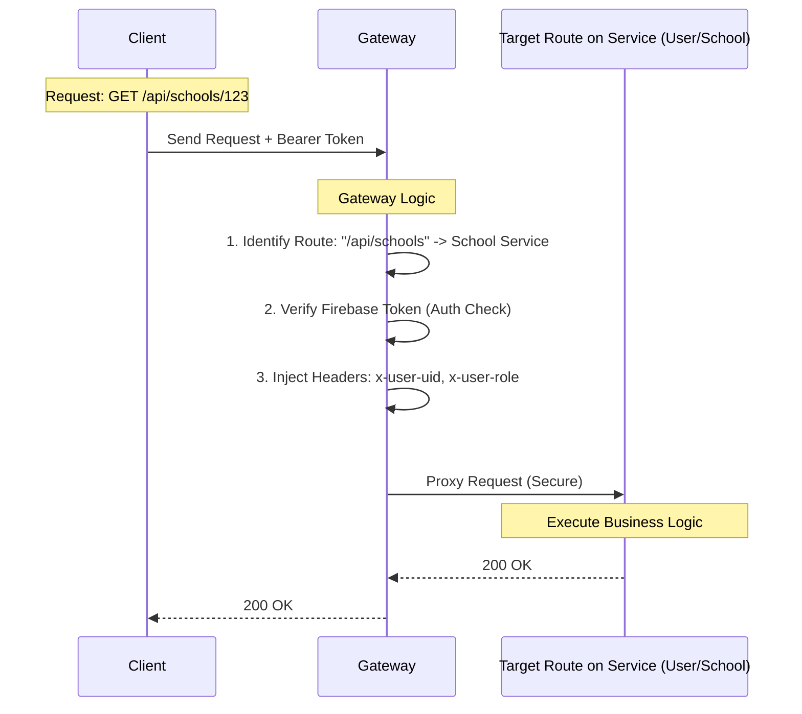
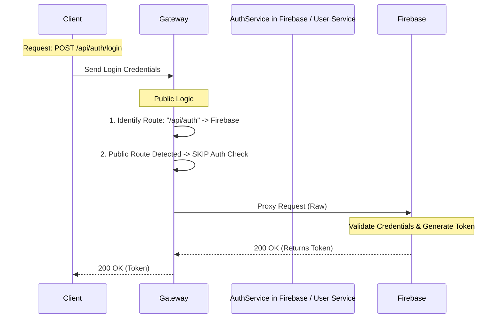

# All-Rounder Backend System

A scalable, microservices-based backend architecture for an educational management platform. This system utilizes a **Smart API Gateway** to orchestrate traffic, handle security, and route requests to specialized microservices based on strict URL patterns.

## 🏗 System Architecture

The core of this system is the **API Gateway**, which acts as the single entry point for all client requests. It decouples the frontend from the backend services, handling routing, authentication, and load balancing.

### 🔑 Key Proxy Patterns

The Gateway handles traffic differently based on the requested route:

1.  **Authenticated Proxy (`/api/users`, `/api/schools`):**
    * **Security:** Enforces Firebase Token verification.
    * **Enrichment:** Injects internal headers (`x-user-uid`, `x-user-type`) so downstream services know *who* is making the request without re-verifying the token.
    * **Routing:** Directs traffic to the specific microservice (User Service, School Service, etc.).

2.  **Public Proxy (`/api/auth`, `/api/public`):**
    * **Open Access:** Bypasses token verification for login, registration, or public data.
    * **Orchestration:** Can trigger complex flows (e.g., "Dual-Write" registration to both Firebase and PostgreSQL).

---


```bash
git clone https://github.com/Dulaksha-Keshan/all-rounder.git
cd all-rounder/backend


##Dependency installing 

# Gateway
cd api-gateway && npm install

# User Service
cd ../user-service && npm install

# Content Service
cd ../content-service && npm install

```

### 🔧 Environment Configuration
Create a `.env` file in the root of each service:

```properties
PORT=[PORT FOR EACH SERVICE]


#GATEWAY SPECIFIC
FIREBASE_PROJECT_ID=[ID]
FIREBASE_CLIENT_EMAIL=[EMAIL]
FIREBASE_PRIVATE_KEY=[PRIVATE KEY]
CONTENT_SERVICE_URL="http://localhost:[PORT]"
USER_SERVICE_URL="http://localhost:[PORT]"


#USER SERVICE SPECIFIC
DATABASE_URL=[POSTGRES URI]
MONGO_URI=[MONGO URI]

#CONTENT SERVICE SPECIFIC

```

## 🔄 API Flow Diagrams

### 1. Scenario: A user requests their profile or school data.



### 2.Scenario: A user logs in or registers. No token is present yet.




## User Service API

### Test Cases

This document outlines the  Request Details (via postman) for testing the User Service. All requests should be sent to the **API Gateway**, which proxies them to the User Service.

---
### User Route

**Base URL:** `http://localhost:3000/api/users`

---

## 1. Get User Profile
Retrieves the profile of the currently logged-in user or a specific target user.

* **Flow:** Client -> Gateway (Auth Check) -> User Service (Fetch Profile)
* **Method:** `GET`
* **URL:** `{{base_url}}/api/users/:id`
    * *Example:* `http://localhost:3000/api/users/user-uid-123`
* **Auth:** Bearer Token (Any valid user)
* **Body:** `None`
* **Expected Response (200 OK):**
    ```json
    {
        "message": "Student fetched successfully",
        "userType": "STUDENT",
        "user": {
            "uid": "user-uid-123",
            "email": "student@school.com",
            "name": "John Doe",
            "is_frozen": false
        }
    }
    ```

---

## 2. Update User Profile
Updates mutable fields (Bio, Phone, etc.). The system automatically prevents updates to sensitive fields like `uid` or `name`.

* **Flow:** Client -> Gateway -> User Service (Update Logic)
* **Method:** `PATCH`
* **URL:** `{{base_url}}/api/users/:id`
    * *Example:* `http://localhost:3000/api/users/user-uid-123`
* **Auth:** Bearer Token (Must match the target UID)
* **Body (Raw JSON):**
    ```json
    {
        "bio": "Updated bio via Postman",
        "contact_number": "0771234567"
    }
    ```
* **Test Scenario (Security):** Try adding `"name": "Hacker"` to the body.
* **Expected Response (200 OK):** The response should show the updated `bio`, but `name` should remain unchanged.

---

## 3. Soft Delete User
Deactivates a user account instead of permanently deleting it.

* **Flow:** Client -> Gateway -> User Service (Set `is_active` to false)
* **Method:** `DELETE`
* **URL:** `{{base_url}}/api/users/:id`
    * *Example:* `http://localhost:3000/api/users/user-uid-123`
* **Auth:** Bearer Token (Must match the target UID or be Super Admin)
* **Body:** `None`
* **Expected Response (200 OK):**
    ```json
    {
        "message": "User deactivated successfully",
        "user": {
            "is_active": false
        }
    }
    ```

---

### School Routes 

**Base URL:** `http://localhost:3000/api/schools`

---

## 1. Create School (Bootstrap)
Creates a new School entity and simultaneously registers the first Admin for that school.

* **Flow:** Client -> Gateway (Role Check) -> School Service (Create School -> Create Admin)
* **Method:** `POST`
* **URL:** `{{base_url}}/api/schools`
    * *Example:* `http://localhost:3000/api/schools`
* **Auth:** Bearer Token (Role: `SUPER_ADMIN`)
* **Body (Raw JSON):**
    ```json
    {
      "school": {
        "name": "Royal Institute",
        "address": "123 Education Drive",
        "district": "Colombo",
        "email": "info@royal.edu",
        "contact_number": "0112233445",
        "principal_name": "Dr. Perera",
        "web_link": "[https://royal.edu](https://royal.edu)"
      },
      "admin": {
        "email": "admin@royal.edu",
        "name": "Royal Admin",
        "password": "SecurePassword123",
        "contact_number": "0771122334"
      }
    }
    ```
* **Expected Response (201 Created):** Returns the new `school` object containing the `school_id`.

---

## 2. Get School Statistics
Fetches real-time counts of students, teachers, and admins for a specific school.

* **Flow:** Client -> Gateway -> School Service (Aggregation Query)
* **Method:** `GET`
* **URL:** `{{base_url}}/api/schools/:id/statistics`
    * *Example:* `http://localhost:3000/api/schools/1/statistics`
* **Auth:** Bearer Token (Role: `SCHOOL_ADMIN` or `SUPER_ADMIN`)
* **Body:** `None`
* **Expected Response (200 OK):**
    ```json
    {
        "schoolId": 1,
        "statistics": {
            "students": 150,
            "teachers": 12,
            "admins": 1,
            "skills": 45
        }
    }
    ```

---

## 3. Update School Details
Updates public information about the school.

* **Flow:** Client -> Gateway -> School Service (Update)
* **Method:** `PATCH`
* **URL:** `{{base_url}}/api/schools/:id`
    * *Example:* `http://localhost:3000/api/schools/1`
* **Auth:** Bearer Token (Role: `SCHOOL_ADMIN` owning this school)
* **Body (Raw JSON):**
    ```json
    {
        "principal_name": "Prof. Silva",
        "web_link": "[https://new-royal-site.edu](https://new-royal-site.edu)"
    }
    ```
* **Expected Response (200 OK):** Returns the updated school object.

---

## 4. Get School Rosters
Retrieves paginated lists of users attached to the school.

* **Method:** `GET`
* **URL 1 (Teachers):** `{{base_url}}/api/schools/:id/teachers`
* **URL 2 (Students):** `{{base_url}}/api/schools/:id/students`
* **Auth:** Bearer Token
* **Body:** `None`
* **Expected Response (200 OK):**
    ```json
    {
        "schoolId": 1,
        "totalStudents": 25,
        "students": [ ...array of student objects... ]
    }
    ```
